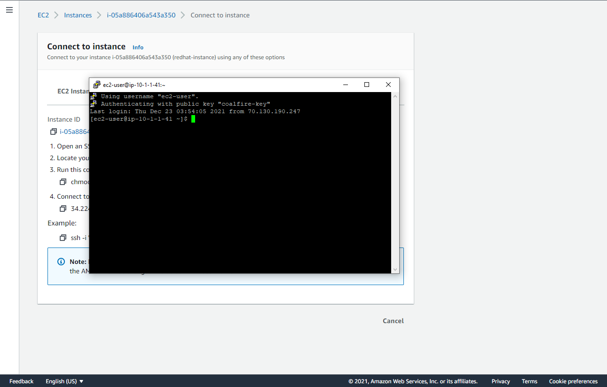
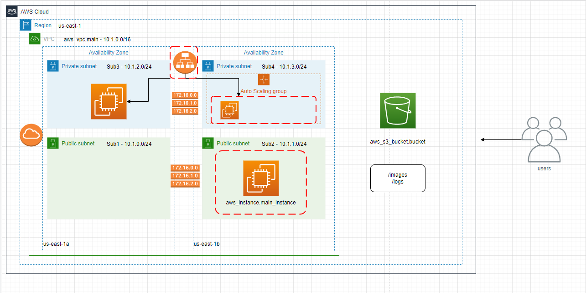

# Coalfire Terraform Challenge
James Maddox | December 23, 2021

## Project Description
A company is looking to create a proof-of-concept environment in AWS. They want a simple VPC as outlined below. The company would also like to use Terraform to manage their infrastructure code.

## Project Requirements
- [x] 1 VPC - 10.1.0.0/16
- [x] 4 Subnets spread across two AZ's
- [x] 1 compute instance running RedHat in sub2
- [x] 1 autoscaling group running RedHat in sub4
- [x] 1 application load balancer that listens on port 80 and forwards traffic to the instance in sub4
- [x] Subnets should have security groups in place
- [x] 1 S3 bucket with lifecycle policies
- [x] Architecture diagram
- [x] Screenshot of RedHat instance logged in

## Process
My process was to initially go down the list of requirements and knock out each item one by one. After I completed every item and was able to get it successfully deployed using 'terraform plan' and 'terraform apply', I then wanted to learn about modules and how to utilize them. I had never used modules in Terraform up until this point so it was a great learning experience and I definitely can see the value in them.

I started with the VPC, which was easy and one of the few things I didn't need to look up. It only really required to declare the CIDR block. I did have to look up how to distinguish how to make subnets accessible and not accessible from the internet. I learned about the 'map_public_ip_on_launch' value in the process. I initially had four different resources for the four subnets but after learning about the element function, I was able to create only two resources 'public subnets' and 'private subnets' and utilize list indices when I needed a particular subnet. I also had never used route table or any of the resources pertaining to route table prior to this project.

Next was the RedHat instance in Sub2. This was also pretty easy to create; I really only needed to look up how to set the specific GB storage by using 'root_block_device'. I also passed in the key value pair here so that I was able to connect to the instance using PuTTY since I'm on Windows.

The autoscaling group and load balancer were what I struggled with the most. I was already familiar with the concepts but was pretty foreign on how to best implement them. I utilized a launch configuration for the sub4 instance and was also where I had the script to install apache. I definitely plan to continue to learn more about the inner-workings of autoscaling groups and load balancers to gain a better understanding of them.

Finally, the S3 bucket was one of the AWS resources I was pretty familiar with. This was one of the sections of the challenge where I needed almost no help but did double check the Terraform docs to ensure I was utilizing the lifecycle rules properly.

All in all, it was a great opportunity and learned a lot! I want to continue learning and improve my knowledge of load balancers, autoscaling groups, building architecture diagrams, etc.

## Resources
95% of the information I needed and used came directly from the Terraform docs. When I needed to deploy a resource, I would simply Google 'terraform aws load balancer' for example. Other resources I used included:

- https://stackoverflow.com/questions/63147590/terraform-missing-resource-instance-key (used when I ran into 'missing resource instance key' error)
- https://www.terraform.io/language/functions/element (used when learning how to use the element function)
- https://www.terraform.io/language/meta-arguments/count (used when learning how to use the count object)
- https://docs.aws.amazon.com/elasticloadbalancing/latest/application/load-balancer-target-groups.html (to learn more about target groups)
- https://docs.aws.amazon.com/AWSEC2/latest/UserGuide/putty.html (used when I was running into issues connecting to my instance)
- https://aws.amazon.com/premiumsupport/knowledge-center/elb-fix-failing-health-checks-alb/ (used to learn why targets had an unhealthy status and to learn about health checks)

## Screenshot of terminal after logging into instance


## Architecture Diagram


## How to Run
```bash
$ terraform init
$ terraform plan
$ terraform apply
```

Run 'terraform destroy' to terminate all resources.